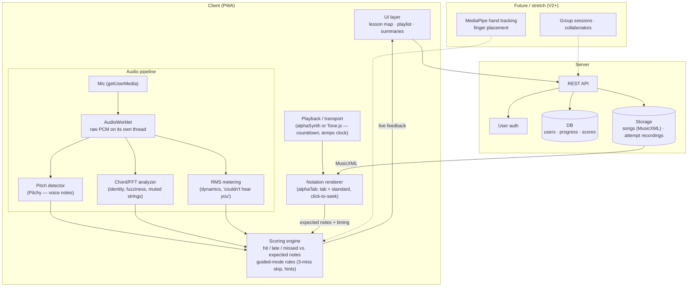

# Rough Architecture

(Second pass — same diagram as before, unchanged in structure. Added: instrument-specific detail for the pitch/chord modules, and an explicit modularity write-up. See `tech-stack.md` for the resolved Flutter/PWA and server decisions.)

## Key decisions embedded in this sketch

1. **All real-time audio analysis happens on the client.** Streaming mic audio to a server can't meet note-by-note latency, and processing locally avoids the heavy-data problem for the live path. Only *results* (scores) and *optional recordings* (compressed) go to the server.
2. **The notation renderer is the source of truth for "expected notes."** alphaTab parses the score; the scoring engine compares detected vs. expected using the playback transport's clock. One clock, no drift.
3. **The server is thin in V1:** auth, progress, scores, song files. All the future social features (group sessions, collaborators) hang off the same API later without touching the audio pipeline.
4. **The three analyzers (pitch / chord / volume) share one AudioWorklet buffer** — voice and guitar features are the same pipeline with different analyzers plugged in.

## Instrument-specific detail: voice vs. guitar

Both instruments start from the same shared buffer (decision #4). They diverge at the analyzer stage because the physical signal is different:

| | Voice | Guitar — single note | Guitar — chord |
|---|---|---|---|
| **Signal shape** | One fundamental frequency at a time | One fundamental frequency at a time | Multiple simultaneous frequencies (one per ringing string) |
| **Algorithm** | Pitchy (autocorrelation / McLeod pitch method) | Pitchy (same as voice) | Raw FFT via `AnalyserNode`, peak-picking matched against the expected chord's frequency fingerprint |
| **Why not plain FFT for single notes** | Real signals are noisy; the loudest FFT peak isn't reliably the true pitch. Autocorrelation-based methods are more robust for this. | Same reasoning as voice | N/A — chords need the full spectrum since there's no single dominant peak by definition |
| **Extra signal used** | Volume/clarity threshold (reject too-quiet or unclear input) | Same volume/clarity gate | RMS energy spread — a clean chord has a tight FFT peak per string; a muted/buzzing string smears energy across frequencies, giving a proxy for "fuzziness" |
| **Output to scoring engine** | Normalized `{note, timestamp, confidence}` event | Same shape | Same shape — the scoring engine never knows whether the event came from voice, single-string, or chord detection |

## Why this is modular / scales to new instruments

1. **Pluggable analyzers on a shared pipeline.** Pitch, chord, and volume detectors are three independent modules reading the same AudioWorklet buffer. A new instrument means writing or reusing an analyzer — it does not require touching mic capture, the worklet, or the scoring engine.
2. **An instrument-agnostic scoring engine.** The scoring engine only consumes the normalized `{note, timestamp, confidence}` event, compared against expected notes parsed by alphaTab. It has no instrument-specific logic. So supporting a new instrument is: (a) one new analyzer emitting the standard event shape, plus (b) song data alphaTab already knows how to parse.

## Open items carried over

- Confirm real-device audio latency on iOS Safari before going further — this is the single biggest technical risk regardless of framework.
- MediaPipe hand tracking and group sessions remain explicitly V2+/stretch.
