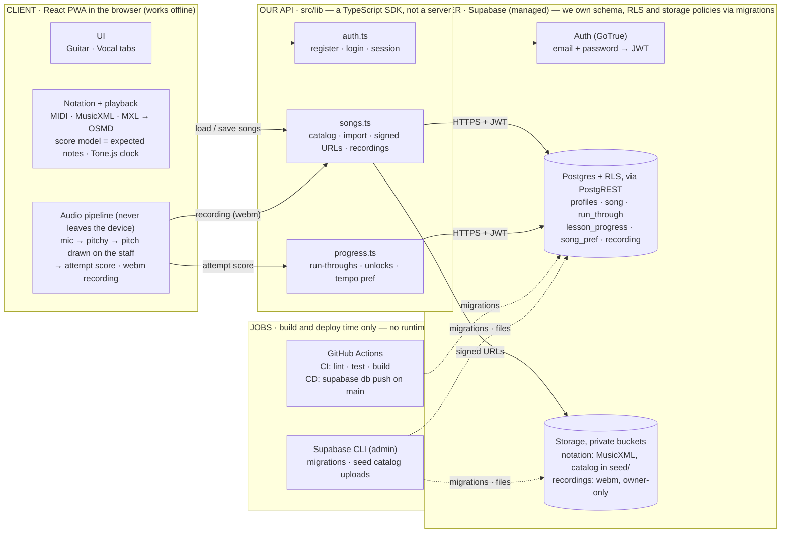

# Architecture

Boxes and arrows for the system as it is built today (Sept 2026): what runs on
the **client**, what **our API** is, and what lives **server-side**. Lanes left
to right; solid arrows are runtime calls, dotted arrows are deploy-time.

## What lives where

| Lane | What it is | Runs where |
|---|---|---|
| **Client** | The whole product experience: notation rendering, playback, mic capture, pitch detection, scoring, recording, offline shell (service worker). | Browser / installed PWA. Zero server round-trips during a practice run. |
| **Our API** | `src/lib` — typed functions (`auth.ts`, `songs.ts`, `progress.ts`) over the Supabase JS SDK. The app imports it as `@backend/*`; the backend test-suite exercises the same code. **There is no Node/Express service of our own.** | In the browser, calling Supabase over HTTPS with the user's JWT. |
| **Server side** | Supabase, managed: GoTrue auth, Postgres behind PostgREST, Storage. What is *ours* there is declarative — migrations that define tables, RLS policies, bucket policies, the profile trigger and the seed catalog. | Supabase cloud (`mxfclxntqbeznbubfmwa`, us-west-2). |
| **Jobs** | GitHub Actions (CI on every PR; `supabase db push` on merge to main) and the Supabase CLI for migrations and catalog uploads. | GitHub-hosted runners / a maintainer's machine. No cron, queues or workers exist yet. |

## What we must do server-side

| Item | Status | Where |
|---|---|---|
| Schema, RLS default-deny (`auth.uid() = user_id`), profile auto-create trigger | done | `supabase/migrations/0001_init.sql` |
| Private buckets `notation` (read: any signed-in user; write: own folder) and `recordings` (owner-only) | done | `0001_init.sql` |
| Seed catalog rows + MusicXML files under `seed/` | done for 4 songs; *House of the Rising Sun* has no file yet | `0002`, `0003`, `supabase/seed/notation/` |
| Email confirmation + custom SMTP | **before launch** — currently OFF for dev | Supabase dashboard → Auth |
| Recording retention / cleanup (req. N3) | not started — needs `pg_cron` or an Edge Function; first real runtime job | — |
| Catalog admin without the CLI (service-role upload) | not started — Edge Function or dashboard only | — |
| Anything touching live mic audio | **never** — latency and privacy; only scores and compressed recordings leave the device | client |

## Key decisions embedded in this sketch

1. **All real-time audio analysis happens on the client.** Streaming mic audio to a server can't meet note-by-note latency, and processing locally avoids the heavy-data problem. Only *results* (scores) and *optional recordings* (webm/opus) go to the server.
2. **The rendered score is the source of truth for "expected notes."** The app derives the playback schedule, cursor stops and the notes to score against from the score OSMD actually rendered, so one clock drives audio, cursor and scoring — no drift, whatever the input format. *(The original plan named alphaTab; the built Vocal tab uses OpenSheetMusicDisplay. Guitar tablature still needs alphaTab or VexFlow — an open decision for the guitar loop.)*
3. **The server is thin and declarative.** Auth, per-user rows, song files. Every server-side behaviour we own is a migration in git, applied by CI — there is no hand-written server code to deploy or scale. The social features (group sessions, collaborators) hang off the same API later without touching the audio pipeline.
4. **One audio pipeline, pluggable analyzers.** Voice and guitar share mic capture and scoring; only the analyzer differs. *(The prototype samples an `AnalyserNode` at ~50 frames/s; moving capture into an `AudioWorklet` is the planned step for lower, steadier latency.)*

## Instrument-specific detail: voice vs. guitar

Both instruments start from the same shared buffer (decision #4). They diverge at the analyzer stage because the physical signal is different:

| | Voice | Guitar — single note | Guitar — chord |
|---|---|---|---|
| **Signal shape** | One fundamental frequency at a time | One fundamental frequency at a time | Multiple simultaneous frequencies (one per ringing string) |
| **Algorithm** | Pitchy (autocorrelation / McLeod pitch method) | Pitchy (same as voice) | Raw FFT via `AnalyserNode`, peak-picking matched against the expected chord's frequency fingerprint |
| **Why not plain FFT for single notes** | Real signals are noisy; the loudest FFT peak isn't reliably the true pitch. Autocorrelation-based methods are more robust for this. | Same reasoning as voice | N/A — chords need the full spectrum since there's no single dominant peak by definition |
| **Extra signal used** | Volume/clarity threshold (reject too-quiet or unclear input) | Same volume/clarity gate | RMS energy spread — a clean chord has a tight FFT peak per string; a muted/buzzing string smears energy across frequencies, giving a proxy for "fuzziness" |
| **Output to scoring engine** | Normalized `{note, timestamp, confidence}` event | Same shape | Same shape — the scoring engine never knows whether the event came from voice, single-string, or chord detection |

## Why this is modular / scales to new instruments

1. **Pluggable analyzers on a shared pipeline.** Pitch, chord, and volume detectors are three independent modules reading the same AudioWorklet buffer. A new instrument means writing or reusing an analyzer — it does not require touching mic capture, the worklet, or the scoring engine.
2. **An instrument-agnostic scoring engine.** The scoring engine only consumes the normalized `{note, timestamp, confidence}` event, compared against expected notes parsed by alphaTab. It has no instrument-specific logic. So supporting a new instrument is: (a) one new analyzer emitting the standard event shape, plus (b) song data alphaTab already knows how to parse.
