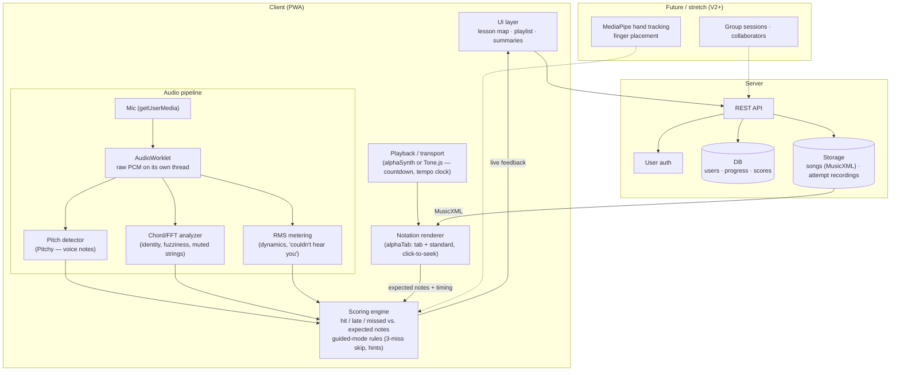

# Rough Architecture Sketch

*(First pass — done with Mermaid, per our plan. Assumes the web/PWA direction; see
[tech-stack.md](tech-stack.md) for the open Flutter question.)*

## Key decisions embedded in this sketch

1. **All real-time audio analysis happens on the client.** Streaming mic audio to a
   server can't meet note-by-note latency, and processing locally avoids the
   heavy-data problem for the live path. Only *results* (scores) and *optional
   recordings* (compressed) go to the server.
2. **The notation renderer is the source of truth for "expected notes."** alphaTab
   parses the score; the scoring engine compares detected vs. expected using the
   playback transport's clock. One clock, no drift.
3. **The server is thin in V1:** auth, progress, scores, song files. All the future
   social features (group sessions, collaborators) hang off the same API later
   without touching the audio pipeline.
4. **The three analyzers (pitch / chord / volume) share one AudioWorklet buffer** —
   voice and guitar features are the same pipeline with different analyzers plugged
   in.

## Open questions

- Flutter vs. PWA (changes the client boxes, not the shape) — see
  [tech-stack.md](tech-stack.md).
- Server stack unchosen (Node/Express? Python? Firebase-style BaaS?).
- Where recordings live and how much we compress (ties to N3 in
  [requirements](../2-scope/requirements.md)).
